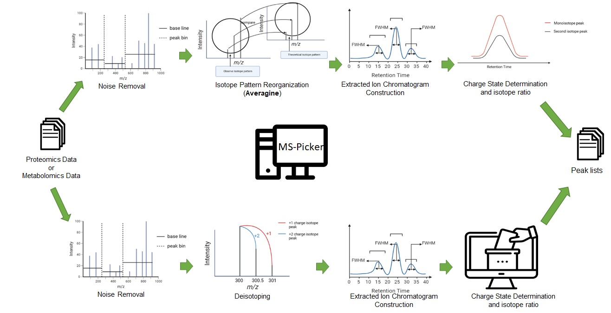

# MS-Picker

## Introduction
MS-Picker is a software tool implemented for detecting peaks from either proteomics or metabolomics data sets generated by the LC-MS/MS platform. For metabolomics data sets, our software tool performs noise removal, de-isotoping, and extracted ion chromatogram (XIC) construction as the algorithms described in [1], exporting the m/z, retention time, charge states and intensities of detected peaks. On the other hand, for proteomics data sets, the algorithm of theoretical isotope pattern generation described in [2] is additionally implemented in MS-Picker for accurate charge state determination.

Figure 1. MS-Picker Workflow, including nosie remal, deisotoping, extracted ion chromatogram construction, and charge state determination. Fro proteomics data, the Averagine procedure [2] is used for the generation of therotical isotope patterns.

## System Requirement
* [Java SE Runtime Environment 15(or above)](https://www.oracle.com/java/technologies/javase/jdk15-archive-downloads.html)

## Parameter Description

|parameter|description|
| ------------- | ------------- |
|omics_index| the index for indicating if the input is a proteomics dataset or a metabolomics dataset. 0: metabolomics; 1: proteomics|
|mzTol| the m/z tolerance for detecting a peak|

## How to Use 
* java -jar MS-Picker omics_index mzTol output_folder input_files
* (for a single file) java -jar MS_Picker.jar 0 0.02 D:\\output_folder D:\\test.mzML
* (for multiple files) java -jar MS_Picker.jar 0 0.02 D:\\output_folder D:\\*.mzML

## References
1. Chang H-Y, Chen C-T, Lih TM, Lynn K-S, Juo C-G, Hsu W-L, et al. (2016) iMet-Q: A User-Friendly Tool for Label-Free Metabolomics Quantitation Using Dynamic Peak-Width Determination. PLoS ONE 11(1): e0146112. https://doi.org/10.1371/journal.pone.0146112
2. Senko MW, Beu SC, McLaffertycor FW. Determination of monoisotopic masses and ion populations for large biomolecules from resolved isotopic distributions. J Am Soc Mass Spectrom. 1995 Apr;6(4):229-33. doi: 10.1016/1044-0305(95)00017-8. PMID: 24214167.(the article about theoretical isotope pattern generation)
